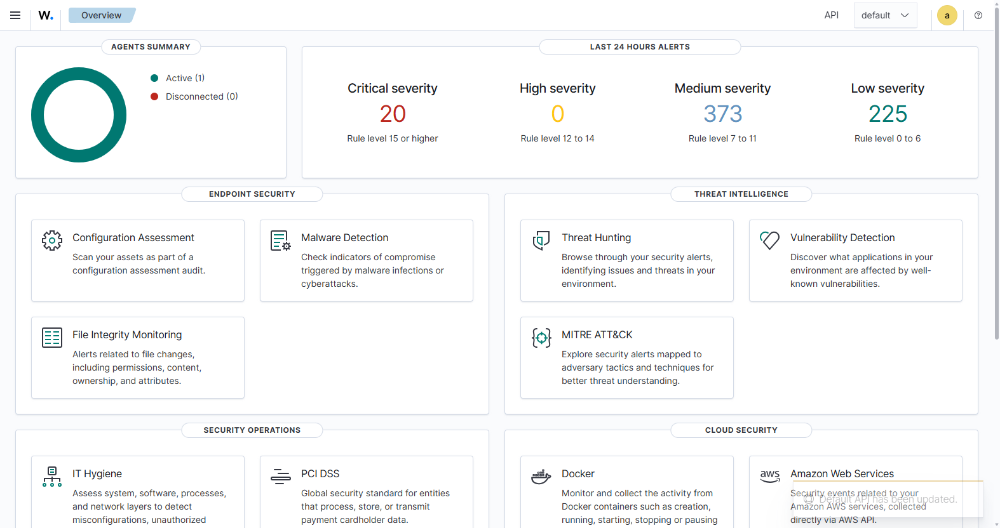
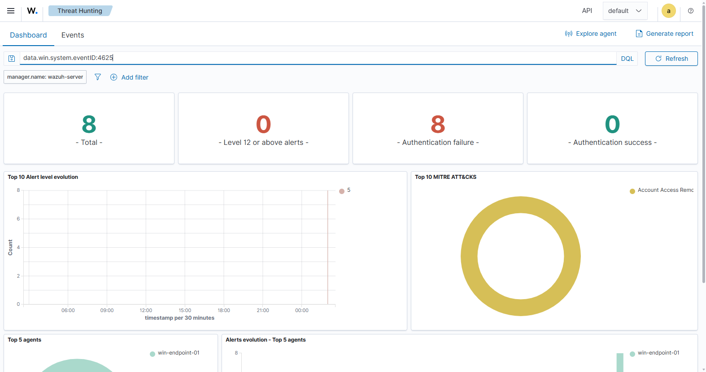
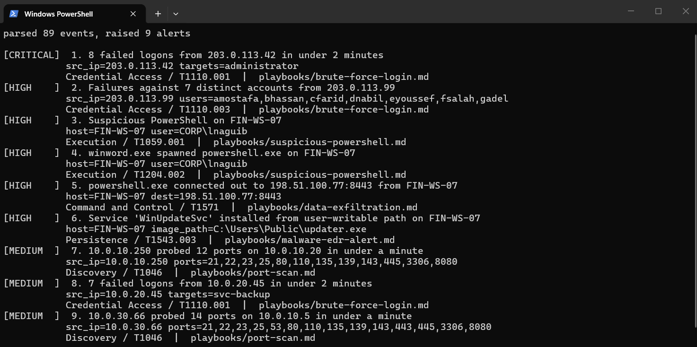

# SOC L1 Detection Lab

A hands-on SOC analyst lab built around Wazuh, Sysmon, Sigma rules, and MITRE ATT&CK. It contains detection rules, synthetic logs with planted attack scenarios and planted false positives, L1 triage playbooks, report templates, and a small Python tool that runs the detections end to end without needing a SIEM. Everything is defensive: the logs are hand-written, the one encoded command decodes to a harmless string, and there is no exploit code anywhere in the repo.

## Why I built it

SOC L1 work is mostly judgment: reading an alert, pulling the surrounding evidence, and deciding whether it is a true positive, a false positive, or authorized activity that happens to look bad. Certifications talk about that skill but do not show it. This repo is my way of showing it: the sample data deliberately mixes real attack patterns with realistic false positives (a broken service account credential, a scheduled vulnerability scanner), because telling those apart is the actual job.

## What it does

- 7 Sigma detection rules covering brute force, password spraying, suspicious PowerShell, Office-spawned shells, service persistence, port scans, and unusual outbound connections, each with documented false positive cases.
- 4 synthetic log sets (Windows Security, Sysmon, firewall, authentication) containing 5 planted attack scenarios, 3 planted false positive or benign scenarios, and normal background noise.
- 7 L1 triage playbooks with a fixed structure: initial questions, evidence, triage steps, FP indicators, escalation criteria, closure notes.
- A Python CLI that applies the same logic as the Sigma rules to the sample logs and produces a triageable markdown alert summary.
- Setup guides for reproducing the full lab with Wazuh and Sysmon on VMs.
- Templates for incident reports and daily and weekly SOC reporting, plus a filled example incident report.

## Security focus

- Detection logic: writing field-based rules with thresholds, and understanding what each rule misses.
- Alert triage: TP vs FP vs benign true positive, with worked examples of the same alert going both ways.
- Log analysis across sources: correlating an Outlook to Word to PowerShell to outbound connection chain across Sysmon and firewall logs.
- MITRE ATT&CK: narrow, evidence-based technique mapping (reasoning documented in `docs/mitre-attack-mapping.md`).
- Escalation discipline: what goes to L2, when, and what a useful handoff contains.

## Tech stack

- Wazuh (SIEM, free and open source)
- Sysmon with the SwiftOnSecurity config
- Sigma (vendor-neutral detection rule format)
- Python 3.11+ standard library only
- MITRE ATT&CK v15 for mappings

## How to run

The parser needs only Python 3.11 or newer:

```
git clone https://github.com/AhmedSalemmm/soc-l1-detection-lab.git
cd soc-l1-detection-lab
python parser/triage.py
```

It prints the alerts and writes `output/alert-summary.md`. Expected result against the included logs: 9 alerts, from one critical (brute force with a successful logon) down to the planted false positives that are there to be triaged, not trusted.

```
parsed 89 events, raised 9 alerts

[CRITICAL]  1. 8 failed logons from 203.0.113.42 in under 2 minutes
[HIGH    ]  2. Failures against 7 distinct accounts from 203.0.113.99
[HIGH    ]  3. Suspicious PowerShell on FIN-WS-07
...
```

To build the full lab with a real SIEM, follow `docs/wazuh-setup-guide.md` and `docs/sysmon-setup-guide.md`.

## Project structure

```
detections/     Sigma rules, one scenario each, with FP notes and MITRE tags
sample-logs/    synthetic JSONL logs with planted scenarios (see its README)
playbooks/      L1 triage playbooks, one per alert type
parser/         triage.py, applies the detection logic without a SIEM
docs/           methodology, setup guides, classification and escalation guides, templates
reports/        example alert summary and a filled example incident report
screenshots/    capture checklist for the VM-based lab
```

## Screenshots

Wazuh overview with the enrolled endpoint and 24-hour alert summary:



Threat hunting filtered to failed logons (event 4625) from the brute-force test:



Parser output against the sample logs:



More captures (agents view, MITRE ATT&CK module, Sysmon Event Viewer) are in `screenshots/`.

## What I learned

- The alert is rarely the decision. The svc-backup scenario fires the same rule as the real attack; the difference is retry cadence, failure reason, and what happened afterwards.
- Thresholds are claims about an environment. Six failures in two minutes is a strong signal in a small lab and background noise on a busy VPN concentrator.
- Writing the false positive section of a rule is harder than writing the detection, and more useful during triage.
- Documenting an escalation properly (what I checked, what I ruled out) takes minutes and saves L2 from redoing the whole investigation.

## Future improvements

- Add impossible travel and exfiltration volume detections to the parser (both currently exist as manual exercises).
- Convert the Sigma rules to native Wazuh rules and commit the tested XML.
- Add a scenario generator so the log sets can be randomized for repeated practice.
- Add Linux auth logs (sshd) and matching detections.
- Add per-alert triage worksheets filled for every planted scenario, not just the brute force case.

## Portfolio note

This project maps to what I want to do professionally: SOC L1, cybersecurity analyst, and cyber defense roles. It covers the daily loop of those jobs (triage, classification, documentation, escalation) on realistic data, and it is honest about scale: this is a lab, not production experience, and the thresholds and rules would need tuning against real volume.

## Author

Ahmed Salem
Cybersecurity graduate focused on GRC, defensive security, SOC analysis, and network security.
LinkedIn: https://www.linkedin.com/in/ahmed-mohamed-salem
